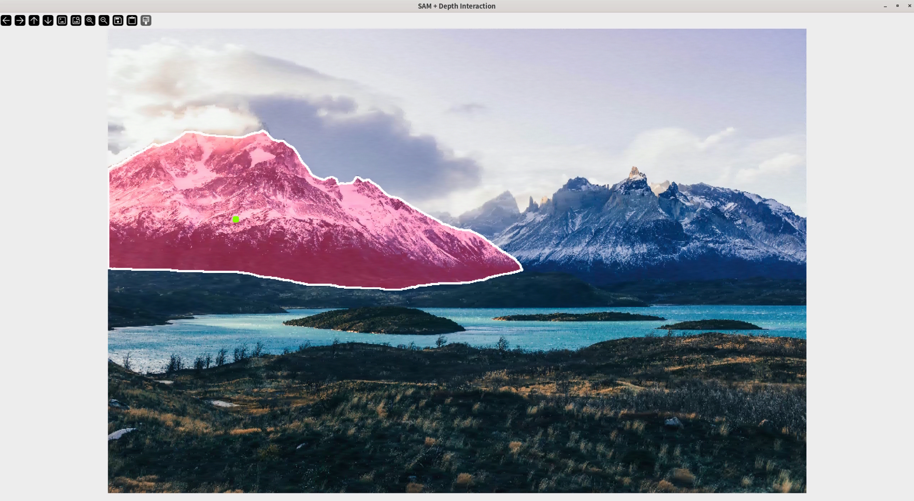
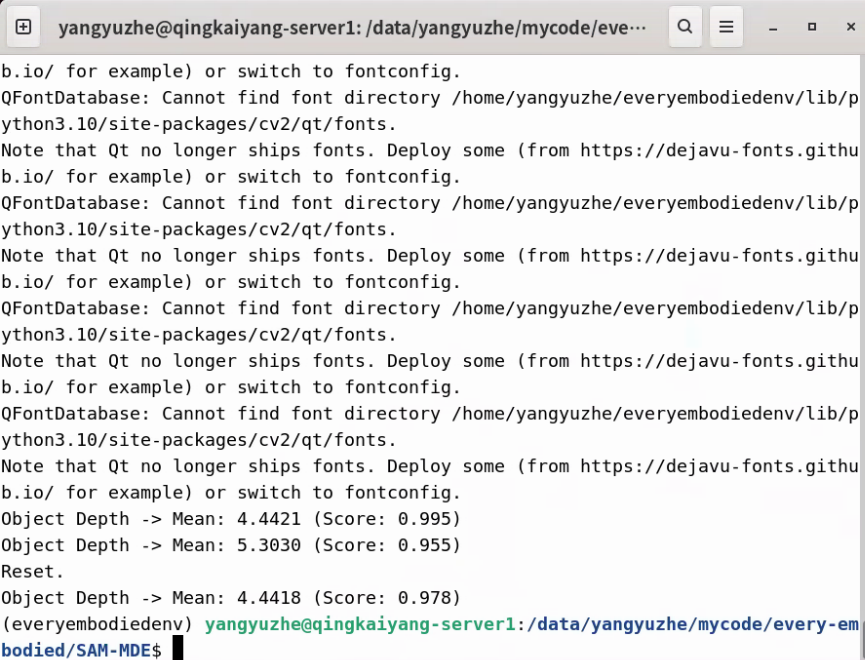
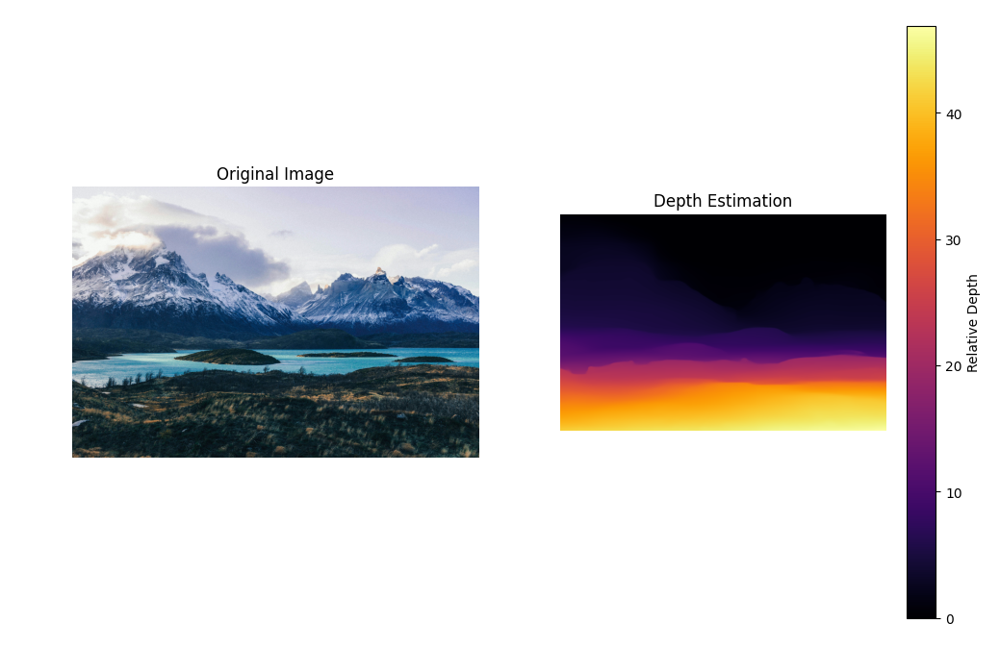
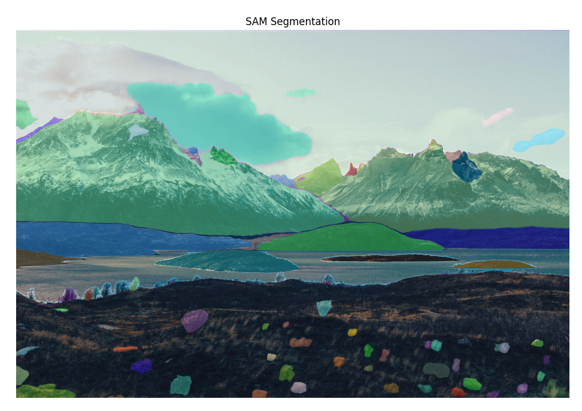
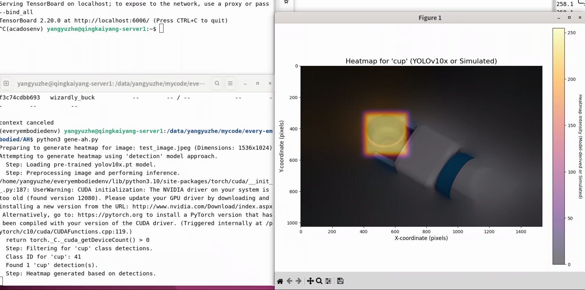

# every_embodied-homework2

task2中的任务感觉比之前要难一些了，可能主要还是因为之前task1中的机器人动力学相关方面了解的比较多。由于时间原因，本周仅看了第4部分中的前两个，一个是sam和深度估计，还有一个是抓取注意力热图

对于视觉部分，我认为我可以算是初学者，对于各种相机的选型以及相关的原理都不是很了解，也算是通过这个课程恶补了一下相关的深度估计、单目相机等软硬件上的知识。代码整体来说都很好复现，但是实在是这周太忙了，仅仅做了一些复现的工作，整体代码都没有进行甚深究，然后LingBot-Map这个工作也没进行复现，这些内容都会在下一次task中进行补充

SAM 分割与单目深度估计部分的代码测试结果：

抓取注意力热图部分：

